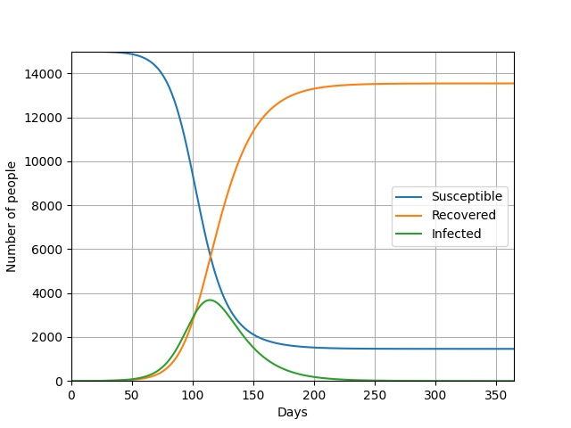

# SIR and other math models for the spread of infection diseases

Python implementation of a few mathematical models that simulate the spread of an infection disease like Covid-19. One of them is the SIR (Susceptible-Infected-Recovered) model.

  

This code base requires Python 3 and [Matplotlib](https://matplotlib.org/). 

I wrote this code in August 2021 to work on a summer research project about SIR and other math models. See a [research report](https://drive.google.com/file/d/1w9b0b7rH0jkMzv2chHG7QXO6b2xJ_MbD/view?usp=sharing), written in Japanese, if you can read Japanese. :smile: 
